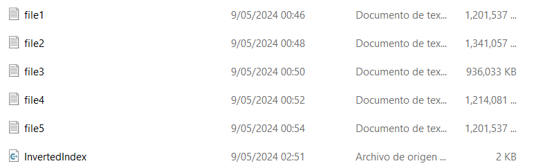
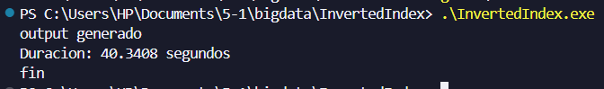

### Laboratorio 2 - Índice invertido

Para la realización del programa, se crearon 5 archivos de texto utilizando los siguientes diccionarios: 

- https://github.com/Shreda/pentestTools/blob/master/random-words.txt
- https://gist.github.com/cjhveal/3753018
- https://www.mit.edu/~ecprice/wordlist.10000

Cada archivo pesaba alrededor de 1 GB: 

El programa utiliza 5 threads, cada uno de los threads lee un archivo y guarda los resultados parciales en una tabla hash. Estos resultados luego se combinan en una tabla final y se escriben en el archivo "output3.txt". 

El programa demora aproximadamente 40 segundos en leer los 5 archivos y escribir el archivo de salida. 

